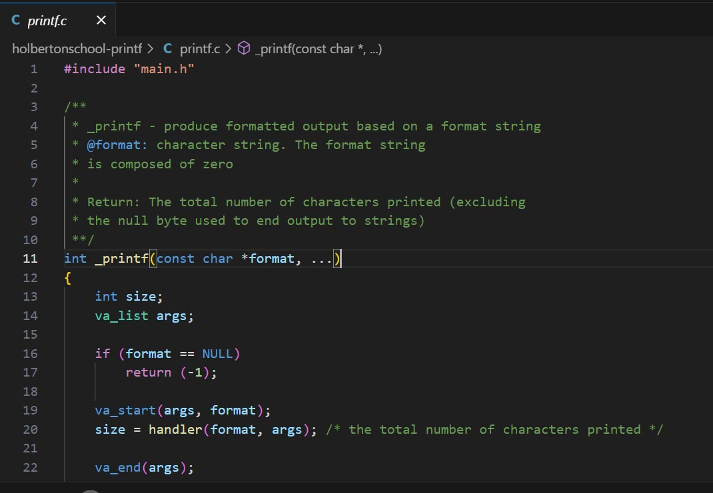

# 🖨️ Custom Printf Implementation

[](https://en.wikipedia.org/wiki/C_(programming_language))
[](https://en.wikipedia.org/wiki/ANSI_C)
[](https://www.holbertonschool.com/)
[](https://github.com/holbertonschool/Betty)



## 📋 Table of Contents
- [Overview](#-overview)
- [Features](#-features)
- [Requirements](#-requirements)
- [Installation](#-installation)
- [Usage](#-usage)
- [Format Specifiers](#-format-specifiers)
- [Function Architecture](#-function-architecture)
- [Testing](#-testing)
- [Project Structure](#-project-structure)
- [Authors](#-authors)

## 🎯 Overview

This project is a custom implementation of the famous `printf()` function from the C standard library. Created as part of the Holberton School curriculum, it demonstrates deep understanding of variadic functions, format string parsing, and low-level output operations in C.

### 🚀 What is _printf?

```c
int _printf(const char *format, ...);
```

Our `_printf` function produces formatted output according to a format string and prints it to the standard output. It mimics the behavior of the standard `printf()` function while being implemented from scratch.

## ✨ Features

- ✅ **Variadic Function Implementation** - Handles variable number of arguments
- ✅ **Multiple Format Specifiers** - Supports characters, strings, integers, and more
- ✅ **Memory Safe** - No memory leaks (validated with Valgrind)
- ✅ **Betty Compliant** - Follows Holberton School's Betty coding standards
- ✅ **Error Handling** - Robust error detection and handling
- ✅ **Custom Binary Conversion** - Includes custom %b specifier for binary output

## 🔧 Requirements

| Component | Specification |
|-----------|---------------|
| **OS** | Ubuntu 20.04 LTS |
| **Compiler** | GCC with flags: `-Wall -Werror -Wextra -pedantic -std=gnu89` |
| **Standard** | C89/C90 |
| **Style** | Betty coding style |
| **Memory** | No leaks allowed |

## 📦 Installation

### 1. Clone the Repository
```bash
git clone https://github.com/Pmichel74/holbertonschool-printf.git
cd holbertonschool-printf
```

### 2. Compile the Project
```bash
gcc -Wall -Werror -Wextra -pedantic -std=gnu89 -Wno-format *.c -o print
```

### 3. Run the Program
```bash
./print
```

## 🎮 Usage

### Basic Example
```c
#include "main.h"

int main(void)
{
    _printf("Hello %s! Number: %d\n", "World", 42);
    _printf("Character: %c\n", 'A');
    _printf("Percentage: %%\n");
    return (0);
}
```

### Output
```
Hello World! Number: 42
Character: A
Percentage: %
```

## 🔤 Format Specifiers

| Specifier | Description | Example |
|-----------|-------------|---------|
| `%c` | Single character | `_printf("%c", 'A')` → `A` |
| `%s` | String of characters | `_printf("%s", "Hello")` → `Hello` |
| `%d` | Signed decimal integer | `_printf("%d", 123)` → `123` |
| `%i` | Signed integer | `_printf("%i", -456)` → `-456` |
| `%b` | Binary representation | `_printf("%b", 98)` → `1100010` |
| `%%` | Literal percent sign | `_printf("%%")` → `%` |

## 🏗️ Function Architecture

### Core Functions

#### `_printf(const char *format, ...)`
**Purpose:** Main entry point that processes format string and coordinates output.

**Parameters:**
- `format`: Format string containing text and format specifiers
- `...`: Variable arguments corresponding to format specifiers

**Returns:** Total number of characters printed, or -1 on error.

---

#### `handler(const char *str, va_list list)`
**Purpose:** Processes the format string and dispatches to appropriate handlers.

**Parameters:**
- `str`: The format string
- `list`: The variadic argument list

**Returns:** Total number of characters printed.

---

#### `percent_handler(const char *str, va_list list, int *i)`
**Purpose:** Handles format specifiers that start with '%'.

**Parameters:**
- `str`: The format string
- `list`: The variadic argument list  
- `i`: Pointer to current position in format string

**Returns:** Number of characters printed for this specifier.

### Helper Functions

| Function | Purpose |
|----------|---------|
| `print_char(va_list)` | Prints a single character |
| `print_string(va_list)` | Prints a string |
| `print_integer(va_list)` | Prints signed integers |
| `print_binary(va_list)` | Prints binary representation |
| `_putchar(char)` | Writes single character to stdout |
| `itoa(long int, int)` | Converts integer to string |

## 🧪 Testing

### Compilation for Testing
```bash
gcc -Wall -Werror -Wextra -pedantic -std=gnu89 -Wno-format *.c test/main.c -o test_printf
```

### Memory Leak Testing with Valgrind
```bash
valgrind --leak-check=full --show-leak-kinds=all ./print
```

### Expected Valgrind Output
```
==XXXXX== HEAP SUMMARY:
==XXXXX==     in use at exit: 0 bytes in 0 blocks
==XXXXX==   total heap usage: 1 allocs, 1 frees, 1,024 bytes allocated
==XXXXX== 
==XXXXX== All heap blocks were freed -- no leaks are possible
==XXXXX== 
==XXXXX== ERROR SUMMARY: 0 errors from 0 contexts
```

### Test Cases Coverage
- ✅ Basic format specifiers (%c, %s, %d, %i)
- ✅ Edge cases (NULL strings, negative numbers)
- ✅ Special specifiers (%%, %b)
- ✅ Memory management
- ✅ Return value accuracy

## 📁 Project Structure

```
holbertonschool-printf/
├── 📄 main.h                  # Header file with function prototypes
├── 📄 printf.c               # Main printf implementation
├── 📄 general_functions.c    # Handler functions and utilities
├── 📄 print_char.c           # Character printing function
├── 📄 print_string.c         # String printing function  
├── 📄 print_integer.c        # Integer printing function
├── 📄 print_binary.c         # Binary printing function
├── 📄 itoa.c                 # Integer to string conversion
├── 📄 man_3_printf.md        # Manual page
├── 📁 test/                  # Test files
│   └── 📄 main.c            # Test cases
├── 📁 img/                   # Documentation images
│   ├── 📄 prnt.png          # Project banner
│   └── 📄 flowchart.jpg     # Function flowchart
└── 📄 README.md              # This file
```

## 📊 Function Flow


The flowchart above illustrates the execution flow of our `_printf` implementation, showing how format strings are parsed and processed.

## 📖 Manual Page

To view the detailed manual page:
```bash
man ./man_3_printf.md
```

The manual page includes:
- Detailed function descriptions
- Parameter specifications
- Return value explanations
- Usage examples
- Compatibility notes

## 🤝 Contributing

This project follows the Holberton School Betty coding style. Contributions should:

1. Follow Betty style guidelines
2. Include appropriate comments
3. Pass all existing tests
4. Include tests for new features

## 📜 License

This project is part of the Holberton School curriculum and is intended for educational purposes.

## 👥 Authors

| Author | GitHub | Email |
|--------|--------|-------|
| **Patrick Michel** | [@Pmichel74](https://github.com/Pmichel74) | patrick.yann.michel@gmail.com |
| **Matteo Foti** | [@MatteoFoti](https://github.com/MatteoFoti) | - |

---

<div align="center">

**🎓 Holberton School - Cohort 25**

*Learning to code by building real projects*

[](https://www.holbertonschool.com/)

</div>
